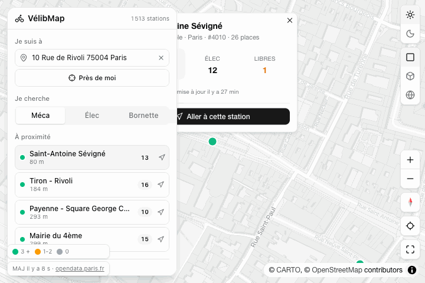

# VélibMap

[](https://github.com/jabahm/velibmap/actions/workflows/deploy-pages.yml)
[](./LICENSE)
[](https://jabahm.github.io/velibmap/)

Carte web open source qui visualise en temps réel la disponibilité des stations **Vélib' Métropole** (vélos mécaniques, vélos électriques, bornettes libres), partout à Paris et en Île-de-France.

Sans clé d'API, sans tracker, 100 % statique. Construit avec [mapcn](https://github.com/AnmolSaini16/mapcn) (MapLibre GL + shadcn) au-dessus du dataset [Vélib' Vélos et bornes Disponibilité temps réel](https://www.data.gouv.fr/datasets/velib-velos-et-bornes-disponibilite-temps-reel/) (Opendata Paris).

> **Démo en ligne :** https://jabahm.github.io/velibmap/



## Fonctionnalités

- **Carte temps réel** des ~1 500 stations, refresh auto toutes les 60 s
- **Clustering** dynamique et marker individuel **coloré selon le besoin** (vert ≥ 3 dispo, ambre 1-2, gris 0)
- **Recherche d'adresse** avec autocomplete via la [Base Adresse Nationale](https://adresse.data.gouv.fr/) (sans clé) ou bouton **« Près de moi »** (géolocalisation navigateur, reverse geocoding BAN)
- **Top 4 stations à proximité** trié par distance haversine
- **Itinéraire piéton** calculé via [OSRM](https://project-osrm.org/) au clic, tracé sur la carte avec temps, distance et heure d'arrivée
- **Détail station** : opérateur, dispo méca/élec/bornettes, capacité, fraîcheur du flux, alertes en cas d'avarie (emprunt/retour fermé)
- **3 modes d'affichage** : 2D plat, 2D incliné (pitch 55°) avec **extrusion 3D des bâtiments OSM**, ou globe 3D, toggle dans la barre des contrôles
- **Thème clair / sombre**, persisté en localStorage, suit la préférence système au premier chargement

## Stack

- [Vite 7](https://vitejs.dev/), [React 19](https://react.dev/), TypeScript
- [Tailwind CSS v4](https://tailwindcss.com/) avec tokens [shadcn/ui](https://ui.shadcn.com/)
- [mapcn](https://github.com/AnmolSaini16/mapcn) : composants carte façon shadcn (MapLibre GL sous le capot)
- [MapLibre GL JS](https://maplibre.org/) : moteur cartographique open source
- Tuiles vectorielles [Carto Positron / Dark Matter](https://carto.com/basemaps) (gratuites, attribuées)
- Géocodage [BAN](https://adresse.data.gouv.fr/), routing piéton [OSRM](https://project-osrm.org/) (demo server)
- Icônes [Lucide](https://lucide.dev/)

## Lancer en local

Prérequis : Node ≥ 22.12 et [pnpm](https://pnpm.io/).

```sh
pnpm install
pnpm dev
```

## Build et déploiement

```sh
pnpm build      # bundle production dans dist/
pnpm preview    # sert dist/ localement
```

## Données

Source officielle : [Vélib' Vélos et bornes Disponibilité temps réel](https://www.data.gouv.fr/datasets/velib-velos-et-bornes-disponibilite-temps-reel/) publié par Vélib' Métropole sur le portail Opendata Paris (licence ODbL).

Endpoint interrogé directement depuis le navigateur, sans clé :

```
https://opendata.paris.fr/api/explore/v2.1/catalog/datasets/velib-disponibilite-en-temps-reel/exports/json
```

Aucune donnée n'est stockée ; l'agrégation est faite côté client à chaque rafraîchissement.

## Configuration

Variables d'environnement Vite (optionnelles) :

| Var | Défaut | Effet |
| --- | --- | --- |
| `VITE_BASE_PATH` | `/` | Préfixe d'URL pour le bundle (utilisé par le workflow Pages) |
| `VITE_OSRM_URL` | `https://router.project-osrm.org` | Endpoint OSRM. Pour la production, self-host ([osrm-backend](https://github.com/Project-OSRM/osrm-backend)) ; le serveur démo n'est pas garanti pour du trafic. |

## Contribuer

Voir [CONTRIBUTING.md](./CONTRIBUTING.md).

## Crédits

- Données : [Vélib' Métropole](https://www.velib-metropole.fr/) via [Opendata Paris](https://opendata.paris.fr/) et [data.gouv.fr](https://www.data.gouv.fr/)
- Géocodage : [Base Adresse Nationale](https://adresse.data.gouv.fr/) (Etalab)
- Carte : [MapLibre GL](https://maplibre.org/), tuiles [Carto](https://carto.com/), bâtiments [OpenStreetMap](https://www.openstreetmap.org/)
- Routing : [OSRM](https://project-osrm.org/)
- Composants : [mapcn](https://github.com/AnmolSaini16/mapcn) par [AnmolSaini16](https://github.com/AnmolSaini16)
- UI : [shadcn/ui](https://ui.shadcn.com/), [Tailwind CSS](https://tailwindcss.com/), [Lucide icons](https://lucide.dev/)

## Licence

[MIT](./LICENSE). Fais-en ce que tu veux.
